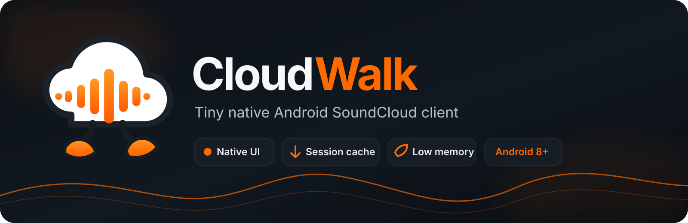
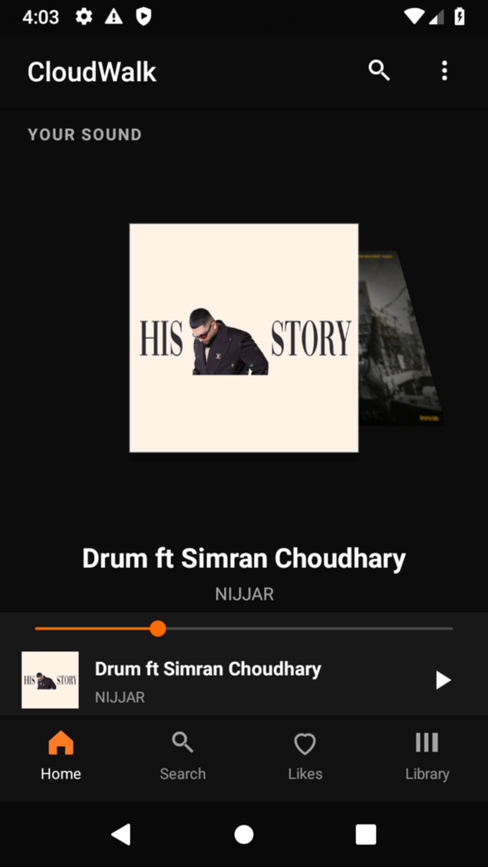
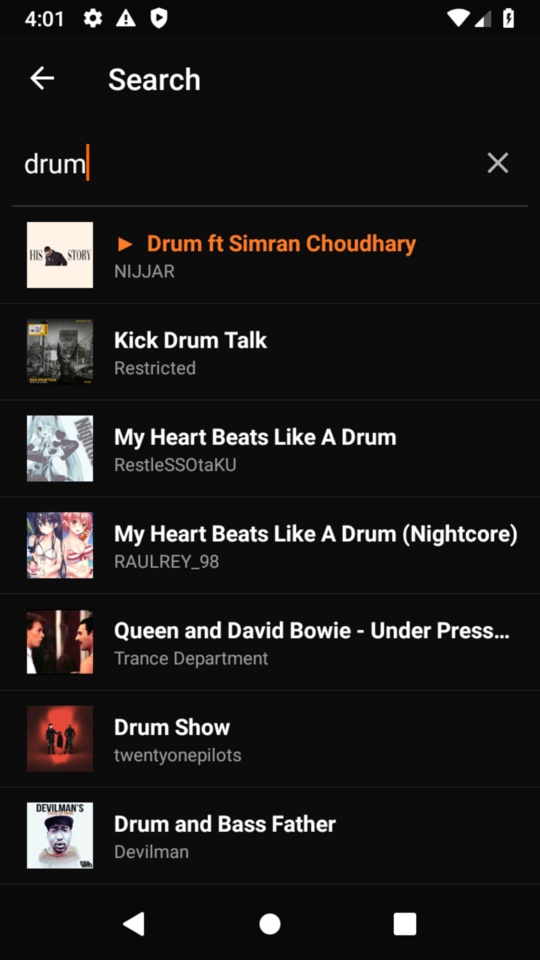
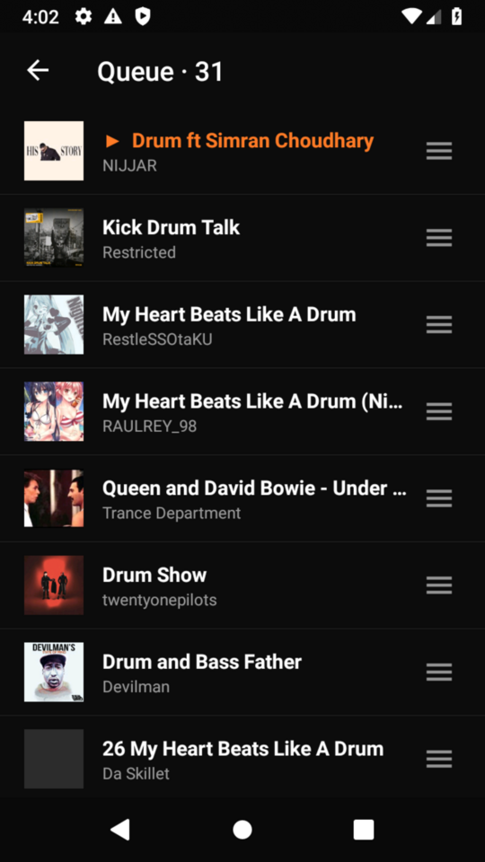
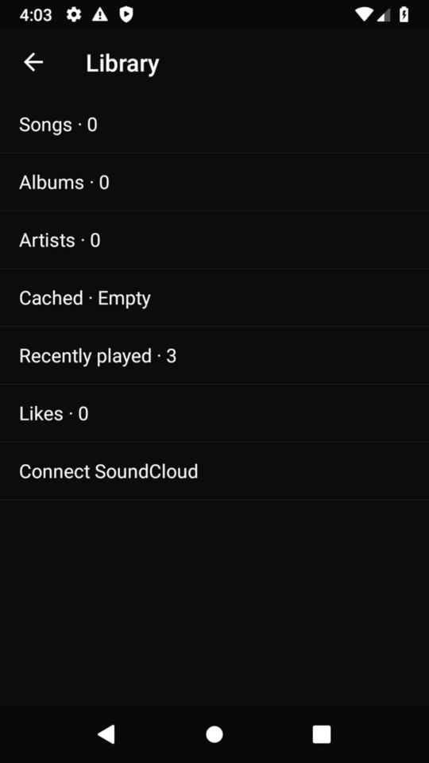

<p align="center">
  
</p>

<p align="center">
  <a href="README.ja.md">日本語</a> · English
</p>

<p align="center">
  <a href="https://github.com/nisesimadao/CloudWalk/releases/latest"></a>
  <a href="https://github.com/nisesimadao/CloudWalk/actions"></a>
  
  
  
</p>

# CloudWalk

CloudWalk is a **tiny native Android SoundCloud client** built for fast startup, low memory use, and older phones. It uses Android Views and platform media APIs instead of a WebView or a heavy UI stack.

<p align="center">
  <a href="https://github.com/nisesimadao/CloudWalk/releases/latest"><b>Download the latest APK</b></a>
</p>

## What it does

- Search and play public SoundCloud tracks
- Cover Flow home screen and native Now Playing UI
- Queue, reorder, shuffle and repeat
- Background playback with MediaSession controls
- Temporary session cache for offline playback
- Local audio files in the same player
- English / Japanese UI
- Android 8.0 (API 26) and newer

## Screenshots

<table>
  <tr>
    <td align="center"><b>Home / Cover Flow</b></td>
    <td align="center"><b>Search</b></td>
    <td align="center"><b>Now Playing</b></td>
  </tr>
  <tr>
    <td></td>
    <td></td>
    <td></td>
  </tr>
  <tr>
    <td align="center"><b>Queue</b></td>
    <td align="center"><b>Library</b></td>
    <td></td>
  </tr>
  <tr>
    <td></td>
    <td></td>
    <td></td>
  </tr>
</table>

> Screenshots above are from the real app running on an Android 9 emulator at a small-phone resolution.

## Build

```sh
./gradlew assembleDebug
```

Release builds use R8/resource shrinking:

```sh
./gradlew assembleRelease
```

## Notes

CloudWalk is experimental and is **not an official SoundCloud app**. Public-track search/playback currently follows SoundCloud's public web client behavior, so SoundCloud-side changes can temporarily break it.

The session cache is temporary and is cleared when CloudWalk closes.
